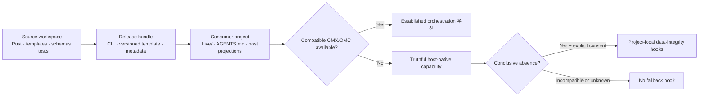

# Aigent Hive

[](rust-toolchain.toml)
[](Cargo.toml)
[](Cargo.toml)
[](.github/workflows/ci.yml)
[](copier.yml)
[](schemas/)
[](crates/hive-wiki)
[](.github/workflows/ci.yml)
[](docs/plans/PLAN.md)
[](LICENSE)

> 🐝 **Aigent Hive**는 Codex, Claude Code, Gemini Antigravity 같은 구독형 agent host 위에서 일관된 setup, Skill routing, 역할·지식·run 상태, 안전한 update와 검증 계약을 제공하는 **provider-neutral 로컬 agent harness**다.

> 🚧 **현재 상태:** 마지막 완료 product version은 `0.6.0`이다. Phase 1–4의 renderer, knowledge/index, portable Skill routing·host projection, persistent role·durable run recovery에 더해 Phase 5 subscription usage guard, one-shot automatic resume authorization, clean-context judge와 protected external trust root 기반 detached Ed25519 quorum이 구현·검증됐다.

Hive는 모델 API나 provider SDK를 사용하지 않으며 API key를 요청하거나 저장하지 않는다. Compatible OMX·OMC가 있으면 검증된 orchestration 기능을 우선 재사용하고, detection이 `absent|incompatible|unknown`이면 표시된 host-native support 범위에서 동작한다. Fallback hook은 그중 conclusive `absent`와 explicit consent에서만 허용한다.

## 목차

- [지원 범위](#지원-범위)
- [핵심 원칙](#핵심-원칙)
- [제품 기능](#제품-기능)
- [아키텍처](#아키텍처)
- [기술 스택](#기술-스택)
- [의존성](#의존성)
- [저장소 구조](#저장소-구조)
- [개발과 검증](#개발과-검증)
- [Canonical knowledge와 disposable index](#canonical-knowledge와-disposable-index)
- [Subscription usage guard](#subscription-usage-guard)
- [Clean-context judge](#clean-context-judge)
- [Git workflow](#git-workflow)
- [현재 상태와 버전 정책](#현재-상태와-버전-정책)
- [라이선스](#라이선스)

## 지원 범위

| 구분 | 지원·동작 방식 | Hive의 필수 build dependency |
| --- | --- | --- |
| 🖥️ 운영체제 | macOS와 Windows CLI | 해당 없음 |
| 🤖 Agent host | Codex, Claude Code, Gemini Antigravity용 host adapter | 아니요 |
| 🧭 Orchestration | Compatible OMX·OMC가 감지되면 해당 기능을 우선 사용 | 아니요 |
| 🪶 Native fallback | OMX·OMC가 unavailable이면 truthful host-native capability 범위에서 동작 | 해당 없음 |
| 🔐 모델 접근 | 사용자의 정액제 host session만 사용 | API·provider SDK 없음 |
| 💾 데이터 | 우선 local-only; 정본은 Git 추적 가능한 text | cloud database 없음 |

OMX·OMC는 Hive와 함께 사용할 수 있는 우선 orchestration layer지만 필수 설치물은 아니다. Hive는 어느 host나 orchestration plugin에도 build 단계에서 결합되지 않는다.

## 핵심 원칙

- 🧩 **Provider-neutral:** 공통 contract를 먼저 정의하고 host별 파일은 projection으로 생성한다.
- ♻️ **재사용 우선:** OMX·OMC가 이미 잘 해결한 plan, team, persistent loop 기능을 다시 만들지 않는다.
- 📝 **Text가 정본:** Markdown·YAML·TOML을 Git으로 추적하며 SQLite는 언제든 재생성 가능한 검색 index로만 사용한다.
- 🛡️ **사용자 데이터 보호:** setup과 update는 ownership, staging, diff, backup, rollback 검증을 거친다.
- 🙋 **명시적 동의:** 외부 orchestration이 없을 때 제안되는 project-local fallback hook도 사용자가 내용을 확인하고 승인해야 설치한다.
- 📦 **Source와 출하물 분리:** 이 저장소의 개발 지침은 소비자 프로젝트에 그대로 복사하지 않는다.

## 제품 기능

| 기능 | 제공하는 보장 | 경계 |
| --- | --- | --- |
| 결정적 setup | typed answer와 capability evidence를 staging에서 검증하고 ownership manifest 범위만 적용한다. Conflict, target retarget, symlink escape와 activation 실패는 user·foreign byte를 보존한 채 중단하거나 rollback한다. | Source workspace에서는 consumer harness를 생성하지 않는다. |
| Portable Skill routing | simple-question gate 뒤 narrow description이 맞는 approved Skill만 자동 선택한다. Codex의 compatible OMX와 Claude의 compatible OMC 기능이 있으면 Hive duplicate보다 우선한다. | Hive는 plan, Ralph, team, persistent loop와 model runtime을 재구현하지 않는다. |
| Prompt refinement | exact 이름 `hive-prompt-refine`으로 명시적인 prompt 작성·개선 intent만 처리한다. 기본은 `refine-only`이며 `refine-and-run`은 사용자의 실행 의도가 명시된 경우에만 허용한다. | 일반 prompt hidden rewrite와 의미 변경을 금지한다. |
| Persistent role·run | Markdown 정본에 role identity, handoff, PLAN-derived criterion, evidence와 immutable orchestration owner를 고정해 fresh session에서 복구한다. | CLI는 dispatch brief data만 준비하며 model이나 subagent를 spawn하지 않는다. |
| Subscription usage guard | 설치된 threshold를 권위값으로 사용하고 session limit이 존재하면 weekly보다 항상 우선한다. Session이 없을 때만 weekly를 사용하며 stale, 역행, scope mismatch와 sensor 불확실성은 automatic continuation을 fail-closed한다. | Optional CodexBar는 local read-only sensor이며 provider API나 credential을 사용하지 않는다. |
| Ed25519 authenticated judge quorum | Clean-context package, owner-sealed assignment, 독립 verdict와 critical human approval 각각을 detached Ed25519 signature로 인증한다. Public key는 consumer target 밖의 agent-write-denied trust root에서만 읽고 owner·judge·approver key purpose와 identity를 분리한다. Elevated는 authenticated 2/3, critical은 distinct judge 3/3와 별도 authenticated human approval이 필요하다. | Hive는 verification만 수행한다. Private key 생성·보관·signing, judge/model 실행과 판단의 진실성은 외부 authority가 소유한다. Unsigned v1은 진단 호환만 제공하고 PASS 권한이 없다. |
| Canonical knowledge와 disposable index | Markdown·YAML·TOML 정본에서 FTS5, tag, alias, backlink와 source graph를 재생성한다. | SQLite는 Git에서 제외된 cache이며 durable fact의 유일한 저장소가 될 수 없다. |

Ed25519 judge의 exact wire format, key separation, trust-root protection과 hostile
failure mode는
[`docs/architecture/judge-trust-boundary.md`](docs/architecture/judge-trust-boundary.md)에,
운영 절차는
[`docs/guides/ed25519-judge-attestations.md`](docs/guides/ed25519-judge-attestations.md)에
정의한다.

## 아키텍처

Hive는 **source workspace**, **release bundle**, **installed harness**를 서로 다른 artifact로 관리한다.



| Artifact | 포함 내용 | 역할 |
| --- | --- | --- |
| Source workspace | Rust source, template, schema, test, 개발 지침 | Hive 자체를 개발하는 이 저장소 |
| Release bundle | CLI binary, versioned template·projection, 검증 metadata | 재현 가능한 GitHub Release 출하물 |
| Installed harness | `.hive/`, `AGENTS.md`, host projection | 독립된 소비자 프로젝트에서 실제로 동작하는 결과물 |

Copier는 template authoring과 CI parity 검증에만 사용한다. 배포된 Rust CLI와 consumer harness는 Python이나 Copier에 의존하지 않는다.

## 기술 스택

| 기술 | 사용 방식 |
| --- | --- |
| Rust stable, Edition 2021 | cross-platform CLI, setup/update 안전 경계와 결정적 projection |
| Cargo workspace | `hive-core`, `hive-render`, `hive-wiki`, `hive-projection`, `hive-cli` 빌드·테스트·lint |
| Markdown | 계획, 지식, 지속형 역할, run 상태와 사람이 읽는 지침의 정본 |
| YAML·TOML | setup 답변, typed 설정, 승인 ledger와 ownership manifest |
| JSON Schema Draft 2020-12 | action, role, run, judge, capability 등 provider-neutral machine contract |
| Copier 9.17.0 + Jinja templates | authoring-time template와 Rust renderer parity fixture |
| Python 3.13 | CI의 Copier·schema conformance test 전용 |
| SQLite | 재생성 가능한 로컬 FTS5·tag·alias·backlink·source graph; 정본이나 Git 추적 대상이 아님 |
| GitHub Actions | Linux·macOS·Windows Rust 검증과 Copier/schema conformance |
| GitHub Releases | 향후 signed CLI와 release bundle 배포 대상 |

## 의존성

Rust runtime은 filesystem containment, schema·serialization, RFC 8785 canonicalization과 digest처럼 setup 안전성에 필요한 범용 crate만 사용한다. Model provider, model API 또는 network SDK dependency는 없다.

| 범위 | 고정 의존성 | 목적 |
| --- | --- | --- |
| Rust runtime | `cap-std==4.0.2` | filesystem capability boundary용으로 고정한 dependency |
| Rust runtime | `cap-primitives==4.0.2`, `cap-fs-ext==4.0.2` | no-follow identity와 ACL-aware effective-access 검증을 보완하는 동일 Bytecode Alliance companion |
| Rust runtime | `tempfile==3.27.0` | 충돌하지 않는 임의 이름의 exclusive staging·activation temp |
| Rust runtime | `rusqlite==0.40.1` + `bundled` | system SQLite 차이를 제거한 disposable FTS5 index; MIT |
| Rust runtime | `jsonschema==0.48.5` | setup·capability·hook contract 검증 |
| Rust runtime | `serde==1.0.229`, `serde_json==1.0.151`, `yaml_serde==0.10.4`, `toml==1.1.3` | typed config parse·projection |
| Rust runtime | `serde_json_canonicalizer==0.3.2`, `sha2==0.11.0` | RFC 8785 consent/evidence와 content digest |
| Rust runtime | `ed25519-dalek==3.0.0` (`default-features=false`) | 외부 trust root에 대한 strict detached Ed25519 verification; signing 기능은 사용하지 않음 |
| Rust toolchain | `stable`, `rustfmt`, `clippy` | build, format, lint와 unit test |
| Template authoring·CI | `copier==9.17.0` | template render와 fixture parity |
| Schema test | `jsonschema[format]==4.25.1` | JSON Schema meta/instance 검증 |
| YAML test | `PyYAML==6.0.2` | setup·projection fixture 검증 |
| CI | `actions/checkout@v7.0.1` | repository checkout; commit SHA로 고정 |
| CI | `actions/setup-python@v7.0.0` | Python 3.13 환경; commit SHA로 고정 |
| CI | `dtolnay/rust-toolchain` | Rust stable 환경; commit SHA로 고정 |

정확한 CI pin은 [`.github/workflows/ci.yml`](.github/workflows/ci.yml), template pin은 [`copier.yml`](copier.yml), Rust 구성은 [`rust-toolchain.toml`](rust-toolchain.toml)에서 관리한다.

## 저장소 구조

```text
.
├── crates/
│   ├── hive-core/       # provider-neutral invariant와 target safety
│   ├── hive-render/     # deterministic staging, ownership, consent와 role materialization
│   ├── hive-wiki/       # Markdown parse/lint와 disposable SQLite projection
│   ├── hive-projection/ # portable Skill routing, prompt 검증과 host별 thin projection
│   └── hive-cli/        # `hive` CLI entry point
├── harness/             # 출하할 template, Skill, profile, projection source
├── schemas/             # provider-neutral JSON Schema contract
├── tests/               # Copier fixture와 conformance test
├── LICENSE              # GitHub가 감지하는 Apache-2.0 전문
├── LICENSES/            # REUSE용 Apache-2.0 canonical 전문
├── REUSE.toml           # file-scope license mapping
├── docs/
│   ├── architecture/    # 현재 설계
│   ├── decisions/       # ADR와 제품 결정
│   ├── plans/PLAN.md    # 유일한 active plan
│   └── state/CURRENT.md # evidence-backed 현재 handoff
├── .agents/             # Hive source 개발 전용 지침; 출하 대상 아님
└── .github/workflows/   # cross-platform CI
```

## 개발과 검증

🛠️ 기본 검증 명령:

```bash
cargo build --workspace --all-targets --all-features --locked
cargo fmt --all --check
cargo clippy --workspace --all-targets --all-features --locked -- -D warnings
cargo test --workspace --all-targets --all-features --locked
cargo run -p hive-cli -- doctor
cargo run -p hive-cli -- check-target /path/to/consumer-project
cargo run -p hive-cli -- index rebuild --target /path/to/consumer-project --output json
cargo run -p hive-cli -- knowledge query --target /path/to/consumer-project --text "search terms" --output json
python -m unittest discover -s tests/conformance -p 'test_phase1_*.py' -v
python -m unittest tests.conformance.test_phase2_wiki -v
python -m unittest discover -s tests/conformance -p 'test_phase3_*.py' -v
python -m unittest tests.conformance.test_phase4_contracts -v
python -m unittest tests.conformance.test_phase5_judge -v
```

Setup은 다음 JSON contract 표면을 사용한다.

```bash
cargo run -p hive-cli -- setup \
  --target /path/to/consumer-project \
  --answers /path/to/setup-answers.yml \
  --capabilities /path/to/capability-evidence.json \
  --dry-run \
  --output json
```

`--dry-run` 대신 `--apply` 또는 `--validate` 중 정확히 하나를 선택한다. CI는 세 host의 Copier default fixture, hostile typed-answer fixture, non-absent hook 거부, Rust/Copier parity, role materialization과 consent 변조도 함께 검증한다.

Fresh exact 검증 결과는 [`docs/state/CURRENT.md`](docs/state/CURRENT.md)에 기록한다.
Linux·macOS·Windows CI matrix는 Phase 1, usage guard, Phase 2 knowledge, Phase 3
Skills/projection, Phase 4 role/run과 Phase 5 judge corpus를 실행한다.

## Canonical knowledge와 disposable index

`hive knowledge ingest`는 5 MiB 이하의 비기밀 source를 content-addressed immutable
Raw revision으로 저장하고 prepared Wiki draft의 `raw:self`를 exact locator로
치환한다. Canonical integration은 project-local lock 아래에서 직렬화된다.

```bash
hive knowledge ingest --target . --source docs/source.md --wiki prepared-page.md --output json
hive knowledge query --target . --text "deterministic index" --output json
hive knowledge lint --target . --output json
hive knowledge delete --target . --page-id old-page --reason obsolete \
  --timestamp 2026-07-24T00:00:00Z --output json
hive index rebuild --target . --output json
```

Index는 FTS5, tag, alias, backlink, source graph와 content hash를 투영한다. Query는
canonical logical digest와 `.stale` marker를 확인하므로 Markdown을 직접 바꾼 뒤에는
rebuild 전 결과를 반환하지 않는다. 삭제는 active Wiki와 더 이상 참조되지 않는 Raw
revision을 제거하고 fingerprint, locator, reason, replacement, timestamp만 suppression
ledger에 남긴다. `reason`은 삭제 prose가 아닌 shipped stable reason-code enum이다.

## Subscription usage guard

Hive의 provider-neutral usage policy는 session window가 있으면 weekly 값이 더 낮거나
malformed 또는 duplicate여도 session만 선택한다. Session이 없을 때만 단일 weekly
window를 fallback으로 사용한다. Automatic resume는 설치된
`.hive/config/harness.toml`의 `usage_stop_remaining_percent`를 권위값으로 읽으며,
`--threshold`를 주면 설치값과 exact하게 같아야 한다. 선택된 window가
`remaining <= threshold`이면 다음 automatic dispatch permit을 발급하지 않는다.
선택 가능한 window가 없거나 snapshot이 stale이거나 account/window가 일치하지 않아도
`usage_unknown`으로 fail-closed한다.

현재 Codex adapter는 자동 설치하지 않은 optional CodexBar `0.45.2`를 shell 없이 고정 argv로 읽는다. Raw account 대신 호출자가 제공한 SHA-256 digest만 비교한다.

```bash
cargo run -p hive-cli -- usage check \
  --account-digest sha256:<64-lowercase-hex> \
  --output json
```

Exit `0`은 그 시점의 snapshot이 core policy를 통과했다는 read-only 판단이다.
`hive run resume --dispatch-intent automatic`은 durable run과 owner continuity를 먼저
검증한 뒤 명시한 active role 하나에 대해서만 fresh snapshot을 평가한다. 이전
snapshot은 Git에서 제외된 `.hive/runtime/usage-history/`에만 bounded하게 저장하고,
같은 reset의 remaining 증가나 measurement/reset 역행은 fail-closed한다. 허용되면
permit을 brief 준비 closure 직전에 소비하고 exact run revision·role·brief에 결합된
authorization ID 하나와 brief 하나만 반환한다. 같은 authorization의 재발급,
limited, unknown 또는 expired 결과는 brief 0개와 recovery data만 반환한다.

Hive는 이미 반환된 JSON이 Hive 밖에서 복사·재생되는 것까지 막을 수 없다. 실제
host/orchestration owner가 authorization ID를 dispatch 시 한 번만 소비해야 한다.
Manual resume는 CodexBar와 runtime history를 읽거나 쓰지 않으며 enforcement를
주장하지 않는다. 어느 경로도 model이나 subagent를 spawn하지 않는다.

## Clean-context judge

`hive judge package`는 결정론적 검증 뒤 goal, acceptance, artifact/evidence digest
reference와 known constraint만 포함한 최소 package를 만든다. Task-agent reasoning,
self-score, 원하는 verdict와 다른 judge 결과는 거부하며 package는
`package_digest`를 제외한 RFC 8785 JCS bytes의 SHA-256에 결합된다.

```bash
hive judge package --target . --request judge-package-request.json --output json
hive judge quorum --target . --request judge-quorum-request.json \
  --trust-root /absolute/admin-protected/judge-trust-root.toml --output json
```

Verdict 전 `judge-assignment`는 exact package·criteria, requester, task agent,
resolved owner와 owner provenance, 고유 slot·judge instance·eligibility evidence를
JCS digest로 고정한다. Requester와 task agent는 roster에 들어갈 수 없다. Verdict는
assignment 뒤의 exact tuple과 timestamp에 결합돼야 하며, critical human approval은
모든 eligible verdict 뒤 별도 digest-bound artifact로 제출해야 한다.

`hive judge quorum`은 target 안의 target-relative artifact와 detached attestation만
bounded no-follow로 읽는다. Public key는 target과 release bundle 밖의 별도
agent-write-denied TOML trust root에서 읽으며 caller가 artifact와 함께 self-certify한
key는 신뢰하지 않는다. Assignment는 `judge-assignment`, verdict는 `judge-verdict`,
critical human approval은 `judge-approval` purpose key로 strict Ed25519 검증한다.
Trust root 전체에서 public-key bytes는 unique여야 하며 owner key, judge key와 human
key 재사용을 거부한다.

Elevated는 authenticated judge 3명 중 2명 PASS, critical은 서로 다른 authenticated
judge 3명 전원 PASS와 owner·judge가 아닌 별도 authenticated human approval을
요구한다. Missing, revoked, out-of-window, wrong-purpose, tampered 또는 duplicate
signature는 PASS로 승격되지 않는다. Unsigned schema v1 request는 기존 artifact
진단을 위해 읽을 수 있지만 항상 `authenticated:false`, `INDETERMINATE`다.

Aggregate output은 count/status, `authenticated`, algorithm과 approval 유효성만
반환하고 identity, key, signature, slot, finding과 개별 verdict를 노출하지 않는다.
Signature는 trusted private-key possession과 exact artifact binding을 증명하지만
judge 판단의 진실성, 실제 사람의 생체 presence 또는 전역 replay를 증명하지 않는다.
Hive는 private key를 생성·읽기·저장·migration하지 않으며 외부 signer가 key custody와
user-presence policy를 소유한다. 자세한 계약은
[`docs/architecture/judge-trust-boundary.md`](docs/architecture/judge-trust-boundary.md)에
정의하고 설치·rotation 절차는
[`docs/guides/ed25519-judge-attestations.md`](docs/guides/ed25519-judge-attestations.md)를
따른다. CLI와 `hive-judge-package` Skill은 read-only이며 model, judge, subagent 또는
external runtime을 직접 실행하지 않는다.

## Git workflow

| Branch | 용도 | 규칙 |
| --- | --- | --- |
| `main` | 보호된 안정·공개 배포 기준 | Pull Request와 필수 CI 필요; 삭제·force push 금지 |
| `develop` | 일반 개발과 통합 | 검증된 변경을 축적한 뒤 `main`으로 Pull Request |

장기 branch는 이 둘만 사용하며, 일반 변경은 `develop`에서 진행한 뒤 Pull Request로 `main`에 반영한다.

## 현재 상태와 버전 정책

| 항목 | 현재 값 |
| --- | --- |
| Product version | `0.6.0` |
| 현재 범위 | Phase 1–4와 Phase 5 usage guard, one-shot automatic resume, clean-context judge package, authenticated detached Ed25519 quorum |
| 검증된 Phase 5 | session 우선·weekly fallback, 10% inclusive stop, protected external trust root, owner/judge/human purpose 분리, elevated 2/3와 critical 3/3+human |
| 다음 구현 | Phase 6 update·migration·release |
| Active plan | [`docs/plans/PLAN.md`](docs/plans/PLAN.md) revision 1.13 |
| Handoff state | [`docs/state/CURRENT.md`](docs/state/CURRENT.md) |

Semantic version `X.Y.Z`는 다음 원칙으로 변경한다.

| 변경 종류 | 증가 항목 | 예시 |
| --- | --- | --- |
| Backward-compatible feature | Minor `Y` | `0.1.0` → `0.2.0` |
| 빠른 compatible bugfix | Patch `Z` | `0.2.0` → `0.2.1` |
| Breaking release | Major `X` | 사용자가 exact target을 명시적으로 지시한 경우에만 허용 |

## 라이선스

📄 Aigent Hive의 CLI, source, 출하 template과 생성된 Hive 소유 material은 모두 [`Apache-2.0`](LICENSE)으로 배포한다.

- 상용·비공개 제품에서 사용·수정·배포할 수 있다.
- 저작권·라이선스 고지와 변경 사항을 보존해야 한다.
- 명시적 특허 허여와 방어 조항이 적용된다.
- 소비자 프로젝트의 기존 source, 문서, 설정과 data는 Hive가 재라이선스하지 않는다.
- 생성된 harness에는 `.hive/LICENSE-AIGENT-HIVE.txt`가 포함된다.

자세한 적용 범위는 [`docs/licensing.md`](docs/licensing.md)와 [`REUSE.toml`](REUSE.toml)에 정의한다.
