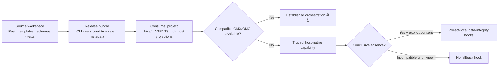

# Aigent Hive

[](rust-toolchain.toml)
[](Cargo.toml)
[](Cargo.toml)
[](.github/workflows/ci.yml)
[](copier.yml)
[](schemas/)
[](crates/hive-wiki)
[](.github/workflows/ci.yml)
[](docs/plans/phases/07-public-qualification.md)
[](LICENSE)

> 🐝 **Aigent Hive:** Codex, Claude Code, Gemini Antigravity 같은 구독형 agent host 위에서 일관된 setup, Skill routing, 역할·지식·run 상태, 안전한 update와 검증 계약을 제공하는 **provider-neutral 로컬 agent harness**

> 🚧 **현재 상태:** product version `0.7.0`; Phase 1–6 완료, Phase 7 qualification `36/42`. macOS arm64·Intel과 Windows x86_64 unsigned current-candidate runtime PASS. 실제 Claude session, protected signing·notarization·publication은 외부 authority 대기.

모델 API·provider SDK 미사용. API key 요청·저장 없음. Compatible OMX·OMC가 있으면
검증된 orchestration 기능 우선 재사용. Detection이 `absent|incompatible|unknown`이면
표시된 host-native support 범위에서 동작. Fallback hook은 conclusive `absent`와
explicit consent에서만 허용.

## 목차

- [지원 범위](#지원-범위)
- [핵심 원칙](#핵심-원칙)
- [제품 기능](#제품-기능)
- [아키텍처](#아키텍처)
- [기술 스택](#기술-스택)
- [의존성](#의존성)
- [저장소 구조](#저장소-구조)
- [개발과 검증](#개발과-검증)
- [Source bilingual LLM Wiki](#source-bilingual-llm-wiki)
- [Source 개발 usage safeguard](#source-개발-usage-safeguard)
- [Canonical knowledge와 disposable index](#canonical-knowledge와-disposable-index)
- [Subscription usage guard](#subscription-usage-guard)
- [Clean-context judge](#clean-context-judge)
- [Signed release와 안전한 update](#signed-release와-안전한-update)
- [Git workflow](#git-workflow)
- [현재 상태와 버전 정책](#현재-상태와-버전-정책)
- [라이선스](#라이선스)

## 지원 범위

| 구분 | 지원·동작 방식 | Hive의 필수 build dependency |
| --- | --- | --- |
| 🖥️ 운영체제 | macOS arm64·Intel과 Windows x86_64 unsigned current-candidate runtime PASS; public signing qualification 대기 | 해당 없음 |
| 🤖 Agent host | Codex·Claude Code·Gemini Antigravity adapter 구현; 실제 session E2E 대기 | 아니요 |
| 🧭 Orchestration | Compatible OMX·OMC가 감지되면 해당 기능을 우선 사용 | 아니요 |
| 🪶 Native fallback | OMX·OMC가 unavailable이면 truthful host-native capability 범위에서 동작 | 해당 없음 |
| 🔐 모델 접근 | 사용자의 정액제 host session만 사용 | API·provider SDK 없음 |
| 💾 데이터 | 우선 local-only; 정본은 Git 추적 가능한 text | cloud database 없음 |

OMX·OMC: Hive와 함께 사용할 수 있는 우선 orchestration layer. 필수 설치 요구와 build-time 결합 없음.

## 핵심 원칙

- 🧩 **Provider-neutral:** 공통 contract를 먼저 정의하고 host별 파일은 projection으로 생성.
- ♻️ **재사용 우선:** OMX·OMC가 제공하는 plan, team, persistent loop 기능의 중복 구현 금지.
- 📝 **Text가 정본:** Markdown·YAML·TOML을 Git으로 추적하며 SQLite는 언제든 재생성 가능한 검색 index로만 사용.
- 🛡️ **사용자 데이터 보호:** setup과 update는 ownership, staging, diff, backup, rollback 검증을 거침.
- 🙋 **명시적 동의:** 외부 orchestration이 없을 때 제안되는 project-local fallback hook도 사용자가 내용을 확인하고 승인해야 설치.
- 📦 **Source와 출하물 분리:** 개발 지침의 소비자 프로젝트 직접 복사 금지.

## 제품 기능

| 기능 | 제공하는 보장 | 경계 |
| --- | --- | --- |
| 결정적 setup | typed answer와 capability evidence의 staging 검증, ownership manifest 범위만 적용. Conflict, target retarget, symlink escape, activation 실패 시 user·foreign byte 보존과 중단·rollback. | Source workspace의 consumer harness 생성 금지. |
| Portable Skill routing | simple-question gate 뒤 narrow description이 맞는 approved Skill만 자동 선택. Codex의 compatible OMX와 Claude의 compatible OMC 기능 우선. | plan, Ralph, team, persistent loop, model runtime 재구현 금지. |
| Prompt refinement | exact 이름 `hive-prompt-refine`으로 명시적인 prompt 작성·개선 intent만 처리. 기본은 `refine-only`이며 `refine-and-run`은 사용자의 실행 의도가 명시된 경우에만 허용. | 일반 prompt hidden rewrite와 의미 변경을 금지. |
| Source bilingual LLM Wiki | `llm-wiki/en/`·`llm-wiki/ko/` exact pair와 reviewed source digest를 검증하고 ignored SQLite index를 무네트워크 재구축. | Source workspace 전용. OMX Wiki·consumer knowledge lifecycle과 분리. |
| Persistent role·run | Markdown 정본에 role identity, handoff, PLAN-derived criterion, evidence, immutable orchestration owner 고정. Fresh session 복구 지원. | CLI 범위는 dispatch brief data 준비까지. Model·subagent spawn 금지. |
| Subscription usage guard | 설치 threshold를 권위값으로 사용. Session limit은 weekly 대비 우선이며 session 부재 시에만 weekly 사용. Stale, 역행, scope mismatch, sensor 불확실성은 automatic continuation fail-closed. | Optional CodexBar: local read-only sensor. Provider API·credential 사용 없음. |
| Ed25519 authenticated judge quorum | Clean-context package, owner-sealed assignment, 독립 verdict와 critical human approval 각각을 detached Ed25519 signature로 인증. Public key는 consumer target 밖의 agent-write-denied trust root에서만 읽고 owner·judge·approver key purpose와 identity를 분리. Elevated는 authenticated 2/3, critical은 distinct judge 3/3와 별도 authenticated human approval이 필요. | Hive는 verification만 수행. Private key 생성·보관·signing, judge/model 실행과 판단의 진실성은 외부 authority가 소유. Unsigned v1은 진단 호환만 제공하며 PASS 권한 없음. |
| Verifier-only signed release와 update | Agent-write-denied public root에서 시작하는 TUF-compatible Ed25519 chain으로 offline root 2-of-3, role별 unique key, root/targets/snapshot/timestamp, target length·SHA-256, expiry·rollback·root rotation을 검증. in-toto/SLSA source·builder·artifact subject와 macOS/Windows signing evidence를 semantic 검증하고 publication에서는 signed source commit, selected candidate commit, exact artifact와 GitHub Sigstore bundle을 모두 대조. Release가 선언한 class를 그대로 믿지 않고 compiled historical surface와 signed cumulative inventory를 비교해 addition/removal/fix를 관찰한 뒤 feature→minor, compatible fix→patch를 강제. Major dry-run은 exact target에 대한 plan·compatibility/preservation·migration digest를 만들고 apply는 그 exact 값의 별도 human confirmation만 허용. Apply 전 protected user tree와 canonical config/team/run/knowledge snapshot, foreign AGENTS marker digest와 self-digested durable journal을 만들고 renderer-owned system path만 atomic activation/recovery하며 SQLite를 text 정본에서 rebuild. | Hive에는 signing/private-key API, downloader, package-manager 실행, downloaded migration code 없음. Candidate OS signing, external TUF authorization과 public publication은 분리된 protected workflow가 소유. Synthetic public fixture evidence는 update integrity test input으로 허용하되 production publication 사용 금지. Direct installer receipt는 기존 executable의 exact SHA-256·version·closed field set과 일치해야 하며 Homebrew/WinGet binary는 각 package manager가 계속 소유. |
| Canonical knowledge와 disposable index | Markdown·YAML·TOML 정본에서 FTS5, tag, alias, backlink와 source graph를 재생성. | SQLite는 Git 제외 cache; durable fact의 유일한 저장소로 사용 금지. |

Ed25519 judge의 exact wire format과 key separation은
[`docs/architecture/judge-trust-boundary.md`](docs/architecture/judge-trust-boundary.md),
운영 절차는
[`docs/guides/ed25519-judge-attestations.md`](docs/guides/ed25519-judge-attestations.md)에
정의. Signed release의 threshold/rotation, version/migration, backup/recovery와
publication 경계는
[`docs/architecture/release-update-trust-boundary.md`](docs/architecture/release-update-trust-boundary.md),
실제 command와 release ceremony:
[`docs/guides/signed-update-and-release.md`](docs/guides/signed-update-and-release.md).

## 아키텍처

Hive는 **source workspace**, **release bundle**, **installed harness**를 서로 다른 artifact로 관리.



| Artifact | 포함 내용 | 역할 |
| --- | --- | --- |
| Source workspace | Rust source, template, schema, test, 개발 지침 | Hive 자체를 개발하는 이 저장소 |
| Release bundle | CLI binary, versioned template·projection, 검증 metadata | 재현 가능한 GitHub Release 출하물 |
| Installed harness | `.hive/`, `AGENTS.md`, host projection | 독립된 소비자 프로젝트에서 실제로 동작하는 결과물 |

Copier 용도: template authoring과 CI parity 검증. 배포 Rust CLI와 consumer harness의 Python·Copier runtime dependency 없음.

## 기술 스택

| 기술 | 사용 방식 |
| --- | --- |
| Rust stable, Edition 2021 | cross-platform CLI, setup/update 안전 경계와 결정적 projection |
| Cargo workspace | `hive-core`, `hive-render`, `hive-wiki`, `hive-projection`, `hive-update`, `hive-cli` 빌드·테스트·lint |
| Markdown | 계획, 지식, 지속형 역할, run 상태와 사람이 읽는 지침의 정본 |
| YAML·TOML | setup 답변, typed 설정, 승인 ledger와 ownership manifest |
| JSON Schema Draft 2020-12 | action, role, run, judge, capability 등 provider-neutral machine contract |
| Copier 9.17.0 + Jinja templates | authoring-time template와 Rust renderer parity fixture |
| Python 3.13 | CI의 Copier·schema conformance test 전용 |
| SQLite | 재생성 가능한 로컬 FTS5·tag·alias·backlink·source graph; 정본·Git 추적 대상 제외 |
| GitHub Actions | Linux·macOS·Windows Rust 검증과 Copier/schema conformance |
| GitHub Releases | OS-signed CLI, externally authorized TUF repository와 immutable release bundle 정본 |

## 의존성

Rust runtime은 filesystem containment, schema·serialization, RFC 8785 canonicalization과 digest처럼 setup 안전성에 필요한 범용 crate만 사용. Model provider, model API 또는 network SDK dependency는 없음.

| 범위 | 고정 의존성 | 목적 |
| --- | --- | --- |
| Rust runtime | `cap-std==4.0.2` | filesystem capability boundary용으로 고정한 dependency |
| Rust runtime | `cap-primitives==4.0.2`, `cap-fs-ext==4.0.2` | no-follow identity와 ACL-aware effective-access 검증을 보완하는 동일 Bytecode Alliance companion |
| Rust runtime | `tempfile==3.27.0` | 충돌하지 않는 임의 이름의 exclusive staging·activation temp |
| Rust runtime | `rusqlite==0.40.1` + `bundled` | system SQLite 차이를 제거한 disposable FTS5 index; MIT |
| Rust runtime | `jsonschema==0.48.5` | setup·capability·hook contract 검증 |
| Rust runtime | `serde==1.0.229`, `serde_json==1.0.151`, `yaml_serde==0.10.4`, `toml==1.1.3` | typed config parse·projection |
| Rust runtime | `serde_json_canonicalizer==0.3.2`, `sha2==0.11.0` | RFC 8785 consent/evidence와 content digest |
| Rust runtime | `ed25519-dalek==3.0.0` (`default-features=false`) | 외부 trust root의 strict detached Ed25519 verification; signing 기능 제외 |
| Rust toolchain | `stable`, `rustfmt`, `clippy` | build, format, lint와 unit test |
| Template authoring·CI | `copier==9.17.0` | template render와 fixture parity |
| Schema test | `jsonschema[format]==4.25.1` | JSON Schema meta/instance 검증 |
| YAML test | `PyYAML==6.0.2` | setup·projection fixture 검증 |
| CI | `actions/checkout@v7.0.1` | repository checkout; commit SHA로 고정 |
| CI | `actions/setup-python@v7.0.0` | Python 3.13 환경; commit SHA로 고정 |
| CI | `dtolnay/rust-toolchain` | Rust stable 환경; commit SHA로 고정 |

정확한 conformance pin은 [`requirements-conformance.txt`](requirements-conformance.txt), template pin은 [`copier.yml`](copier.yml), Rust 구성은 [`rust-toolchain.toml`](rust-toolchain.toml)에서 관리.

## 저장소 구조

```text
.
├── crates/
│   ├── hive-core/       # provider-neutral invariant와 target safety
│   ├── hive-render/     # deterministic staging, ownership, consent와 role materialization
│   ├── hive-wiki/       # Markdown parse/lint와 disposable SQLite projection
│   ├── hive-projection/ # portable Skill routing, prompt 검증과 host별 thin projection
│   ├── hive-update/     # TUF/Ed25519 verification, version/migration, backup와 recovery
│   └── hive-cli/        # `hive` CLI entry point
├── packaging/           # Homebrew/WinGet source manifest template
├── scripts/             # version gate와 direct signed bootstrap
├── harness/             # 출하할 template, Skill, profile, projection source
├── schemas/             # provider-neutral JSON Schema contract
├── tests/               # Copier fixture와 conformance test
├── llm-wiki/            # 영어·한국어 source knowledge 정본
├── LICENSE              # GitHub가 감지하는 Apache-2.0 전문
├── LICENSES/            # REUSE용 Apache-2.0 canonical 전문
├── REUSE.toml           # file-scope license mapping
├── docs/
│   ├── architecture/    # 현재 설계
│   ├── decisions/       # ADR와 제품 결정
│   ├── plans/PLAN.md    # compact active plan index; detail은 linked fragment
│   └── state/CURRENT.md # evidence-backed 현재 handoff
├── .agents/             # Hive source 개발 전용 지침; 출하 대상 제외
└── .github/workflows/   # cross-platform CI
```

## 개발과 검증

🛠️ 기본 검증 명령:

```bash
python scripts/dev-check.py rust
python scripts/dev-check.py python
python scripts/dev-check.py pre-push
python scripts/dev-check.py rust test -p hive-core
python scripts/dev-check.py python tests.conformance.test_phase4_contracts -v
```

`dev-check.py`: caller 환경 변경 없는 로컬 검증. Rust toolchain은 `PATH`와 rustup stable
경로에서 탐색. Python conformance는 `uv` isolated environment와
`requirements-conformance.txt` 사용.

세부 명령:

```bash
cargo build --workspace --all-targets --all-features --locked
cargo fmt --all --check
cargo clippy --workspace --all-targets --all-features --locked -- -D warnings
cargo test --workspace --all-targets --all-features --locked
cargo run -p hive-cli -- doctor
cargo run -p hive-cli -- check-target /path/to/consumer-project
cargo run -p hive-cli -- index rebuild --target /path/to/consumer-project --output json
cargo run -p hive-cli -- knowledge query --target /path/to/consumer-project --text "search terms" --output json
python -m unittest discover -s tests/conformance -p 'test_phase1_*.py' -v
python -m unittest tests.conformance.test_phase2_wiki -v
python -m unittest discover -s tests/conformance -p 'test_phase3_*.py' -v
python -m unittest tests.conformance.test_phase4_contracts -v
python -m unittest tests.conformance.test_phase5_judge -v
python -m unittest tests.conformance.test_phase6_update -v
```

## Source bilingual LLM Wiki

Source knowledge 정본: 영어 [`llm-wiki/en/`](llm-wiki/en/), 한국어
[`llm-wiki/ko/`](llm-wiki/ko/). SQLite index와 persistent advisory lock은 ignored
`.agents/work/source-wiki/` 아래의 disposable·coordination state.

```bash
hive source-wiki index --target . --output json
hive source-wiki lint --target . --output json
hive source-wiki query --target . --language en --text "source architecture" --output json
hive source-wiki query --target . --language ko --text "소스 아키텍처" --output json
```

`lint`와 `query`: missing·stale·corrupt·crash-interrupted index에서 implicit repair 없는
fail-closed. Rebuild authority: explicit `index` command만 보유.

OMX/OMC는 현재 source orchestration 보조로 사용하지만 durable Wiki authority에서는
제외. 이유와 향후 OMX/OMC retirement 시 knowledge migration 0건 원칙:
[`ADR-0011`](docs/decisions/ADR-0011-source-wiki-independence.md).

## Source 개발 usage safeguard

이 저장소 자체의 장시간 Codex 작업에는 source-only `hive-usage-guard` Skill을 사용.
Qualified Codex app-server native sensor를 먼저 사용하고 CodexBar `0.45.2`는
fallback-only. 별도 watcher가 기본 15초 간격으로 읽고, 매 user turn의 simple-question
판별 전과 각 tool, mutation, delegation, external write, push, 최종 응답 전 fresh
gate가 halt marker를 강제. Session limit이 있으면 weekly보다
우선하고, 없을 때만 weekly를 사용. 기본 중지선은 remaining `10%` inclusive이며
quota sensor unknown은 3초 뒤 1회 재시도 후 일시 오류로 기록하고 진행. 이전
confirmed-limited marker와 session·path·integrity 오류는 계속 fail-closed.

Source-local threshold 변경 범위: `1..99`. Guard off는 사용자의
명시적 의도와 confirmation flag가 필요하고 current session ID·Codex process에만
결합. 새 session으로 우회 전달 금지. Watcher의 Codex App process kill·signal과
`.omx/` 수정 금지.
`omx cancel` 결과는 durable goal 종료 증거에서 제외. 모든 상태는 Git에서 제외된
`.agents/work/usage-guard/`에 저장.

Skill 이름 지정 불필요. `사용량 가드를 잔여 15%로 바꿔 줘`, `이 session에서
사용량 가드를 우회해`, `session 우회를 해제하고 다시 켜 줘`처럼 의도가 분명하면
자동 적용. 반대로 `계속해`나 `resume`만으로는 우회 추론 없음. 중지선에
도달한 같은 session에서는 명시적인 current-session 우회 전까지 모든 일반 task를
차단.

이 절의 source watcher·gate: 개발 workspace 전용 보호 기능. 정확한 command, 상태,
보장 경계는 [`docs/guides/source-usage-guard.md`](docs/guides/source-usage-guard.md) 참조.
별도의 출하 `hive-usage-guard` Skill과 typed CLI는 consumer 제품 기능. 세 host
projection의 one-shot pre-dispatch gate는 구현 완료. 실제 host session E2E와
Codex 외 qualified sensor는 Phase 7 qualification 경계.

## User onboarding과 project harness

User-scope 설치 흐름:

1. `hive install --scope user`: `setup-hive`·`hive-update`만 포함한 minimal bootstrap
2. `setup-hive`: 한 번에 질문 하나씩 수집
3. `hive setup --scope user`: 검증·preview·복수 host activation
4. `operational`: 선택한 provider-neutral directive·Skill만 활성화

Global setup 선택:

- Interface language: `en|ko`
- LLM Wiki language: `en|ko|both`
- User profile·agent persona
- Codex·Claude Code·Antigravity host 조합
- Recommended Skill suite 또는 개별 Skill
- LLM Wiki: default-on opt-out, Markdown 보존과 SQLite 제거 분리
- Usage guard: explicit opt-in, default remaining threshold `20%`,
  native-first sensor와 CodexBar fallback 별도 동의

```bash
hive install --scope user --host codex \
  --user-root <user-root> --apply --output json

hive setup --scope user \
  --answers <user-setup.yml> \
  --user-root <user-root> \
  --dry-run --output json
```

`--dry-run` 검토 뒤 `--apply`, 설치 상태 확인은 `--validate`.

설치 version과 release date 확인:

```text
hive --version
hive -v
```

출력 예시: `hive 0.7.0 (released 2026-07-24)`
Host 제거가 필요한 재설정은 silent deactivation 대신 actionable conflict 반환.
Bootstrap 상태의 ordinary Hive Skill activation 없음.

Project setup:

```bash
cargo run -p hive-cli -- setup \
  --target /path/to/consumer-project \
  --answers /path/to/setup-answers.yml \
  --capabilities /path/to/capability-evidence.json \
  --user-root /path/to/user-root \
  --dry-run \
  --output json
```

모든 mode: project kind 필수 입력.
`expedited`: global language·Wiki·persona·Skill·usage 설정 상속.
`custom`: project language·Wiki·persona·Skill override 명시.
Project Markdown Wiki는 project 정본, SQLite는 user root의
`.hive/index/hive.sqlite3` 하나만 사용.
모든 project setup은 operational user root와 `--user-root`를 필수로 요구.
인증된 `0.7.x` standalone project는 migration·knowledge compatibility 표면에서만 지원.

CI 범위: 세 host Copier fixture, typed answer, role materialization, selected projection,
global→project 연결, shared index provenance·visibility 검증.

Fresh exact 검증 결과 위치:
[`docs/state/CURRENT.md`](docs/state/CURRENT.md). Linux·macOS·Windows CI matrix의
범위: Phase 1–7 관련 setup, knowledge, Skill/projection, role/run, usage, judge,
release/update conformance.

## Canonical knowledge와 disposable index

`hive knowledge ingest`는 5 MiB 이하의 비기밀 source를 content-addressed immutable
Raw revision으로 저장하고 prepared Wiki draft의 `raw:self`를 exact locator로
치환. Canonical integration은 project-local lock 아래에서 직렬화.

```bash
hive knowledge ingest --target . --user-root <user-root> \
  --source docs/source.md --wiki prepared-page.md --output json
hive knowledge query --target . --user-root <user-root> \
  --text "deterministic index" --output json
hive knowledge lint --target . --user-root <user-root> --output json
hive knowledge delete --target . --page-id old-page --reason obsolete \
  --user-root <user-root> --timestamp 2026-07-24T00:00:00Z --output json
hive index rebuild --user-root <user-root> --output json
```

Shared index projection: user Wiki + enabled project Wiki, FTS5·tag·alias·source graph,
source project·language·digest·visibility provenance.
Project-private·confidential row의 cross-project query 차단.
Canonical Markdown 직접 변경 뒤 explicit user-root rebuild 전 query 결과 반환 금지.
`--target` index rebuild: `0.7.x` legacy compatibility 표면.

## Subscription usage guard

Hive의 provider-neutral usage policy는 session window가 있으면 weekly 값이 더 낮거나
malformed 또는 duplicate여도 session만 선택. Session이 없을 때만 단일 weekly
window를 fallback으로 사용. Automatic resume는 설치된
`.hive/config/harness.toml`의 `usage_stop_remaining_percent`를 권위값으로 읽으며,
`--threshold`를 주면 설치값과 exact하게 일치 필요. 선택된 window가
`remaining <= threshold`이면 다음 automatic dispatch permit 발급 금지.
선택 가능한 window가 없거나 snapshot이 stale이거나 account/window가 일치하지 않아도
`usage_unknown`으로 fail-closed.

Codex·Claude Code·Antigravity adapter: qualified native CLI sensor 우선.
CodexBar `0.45.2`: allowlisted native 오류에서만 1회 사용하는 optional fallback.
Raw account 저장 없음; SHA-256 account digest만 비교.

```bash
cargo run -p hive-cli -- usage check \
  --account-digest sha256:<64-lowercase-hex> \
  --output json
```

출하 `hive-usage-guard` Skill 자동 선택 범위: 새 automatic dispatch 직전 preflight와
명백한 status·threshold·current-session 제어 intent. 설치 threshold는 Hive-owned root
key만 원자적으로 변경하고, session override는 raw ID 없이 current session digest·PID에만
결합. 새 session과 stale PID는 기본 활성화 상태. Signed same-major update는 설치
threshold를 temporary typed answers로 전달해 migration 뒤에도 같은 값 보존.

```bash
hive usage enforce --target . \
  --session-id <current-session-id> --process-id <current-process-id> \
  [--account-digest <active-account-digest>] --output json
hive usage status --target . \
  --session-id <current-session-id> --process-id <current-process-id> --output json
hive usage threshold --target . --remaining-percent 10 --output json
hive usage session --target . \
  --session-id <current-session-id> --process-id <current-process-id> \
  --action disable --confirm-session-disable --output json
hive usage session --target . \
  --session-id <current-session-id> --process-id <current-process-id> \
  --action enable --output json
```

Skill 이름 없는 명백한 bypass·restore 요청도 지원하되 bare `continue`·`resume`은
disable 승인 제외. Skill은 fallback hook, prompt rewrite, watcher, 다른 Skill activation,
orchestration과 중지된 task continuation은 설치·수행 범위에서 제외. `status`는 조회
전용이며 automatic-dispatch preflight 대체 불가. 일반 응답, manual 작업과
non-dispatch action에는 `enforce` 호출 없음. 외부 OMX/OMC cancellation 결과는 보조
evidence일 뿐 halt marker나 durable goal/task 상태 대체 불가.

`hive usage enforce` exit `0`: 해당 session binding의 preflight 통과만 의미,
dispatch authorization 아님. Current halt marker 우선이며 exit `3`은 해당 automatic
dispatch 차단. Confirmed session disable은 preflight 우회일 뿐 dispatch authorization
효과 없음. Installed `primary_host`와 pinned run·capability host 불일치도 차단하며,
Non-Codex automatic dispatch는 qualified local sensor 전까지 fail-closed.
`hive run resume --dispatch-intent automatic`은 durable run과 owner continuity를 먼저
검증한 뒤 명시한 active role 하나에 대해서만 fresh snapshot을 평가. 이전
snapshot은 Git에서 제외된 `.hive/runtime/usage-history/`에만 bounded하게 저장하고,
같은 reset의 remaining 증가나 measurement/reset 역행은 fail-closed. 허용되면
permit을 brief 준비 closure 직전에 소비하고 exact run revision·role·brief에 결합된
`data.usage_guard.enforced=true`, `outcome=authorized`, authorization ID 하나와
dispatch brief 정확히 하나만 반환. 같은 authorization의 재발급,
limited, unknown 또는 expired 결과는 brief 0개와 recovery data만 반환.

Hive 외부의 captured JSON replay 방지: 실제 host/orchestration owner 책임.
Authorization ID 일회 소비 필수.
Manual resume: CodexBar와 runtime history read/write 없음, enforcement 주장 금지.
모든 resume 경로에서 model·subagent spawn 금지.

## Clean-context judge

`hive judge package`는 결정론적 검증 뒤 goal, acceptance, artifact/evidence digest
reference와 known constraint만 포함한 최소 package를 생성. Task-agent reasoning,
self-score, 원하는 verdict와 다른 judge 결과는 거부하며 package는
`package_digest`를 제외한 RFC 8785 JCS bytes의 SHA-256에 결합.

```bash
hive judge package --target . --request judge-package-request.json --output json
hive judge quorum --target . --request judge-quorum-request.json \
  --trust-root /absolute/admin-protected/judge-trust-root.toml --output json
```

Verdict 전 `judge-assignment`는 exact package·criteria, requester, task agent,
resolved owner와 owner provenance, 고유 slot·judge instance·eligibility evidence를
JCS digest로 고정. Requester와 task agent의 roster 참여 금지. Verdict는
assignment 뒤의 exact tuple과 timestamp에 결합돼야 하며, critical human approval은
모든 eligible verdict 뒤 별도 digest-bound artifact 제출 필수.

`hive judge quorum`은 target 안의 target-relative artifact와 detached attestation만
bounded no-follow read. Public key는 target과 release bundle 밖의 별도
agent-write-denied TOML trust root에서 읽으며 caller가 artifact와 함께 self-certify한
key 신뢰 금지. Assignment는 `judge-assignment`, verdict는 `judge-verdict`,
critical human approval은 `judge-approval` purpose key로 strict Ed25519 검증.
Trust root 전체에서 public-key bytes는 unique여야 하며 owner key, judge key와 human
key 재사용을 거부.

Elevated는 authenticated judge 3명 중 2명 PASS, critical은 서로 다른 authenticated
judge 3명 전원 PASS와 owner·judge가 아닌 별도 authenticated human approval을
요구. Missing, revoked, out-of-window, wrong-purpose, tampered 또는 duplicate
signature의 PASS 승격 금지. Unsigned schema v1 request는 기존 artifact
진단에만 사용. 결과: `authenticated:false`, `INDETERMINATE`.

Aggregate output은 count/status, `authenticated`, algorithm과 approval 유효성만
반환. Identity, key, signature, slot, finding, 개별 verdict 노출 금지.
Signature는 trusted private-key possession과 exact artifact binding을 증명하지만
judge 판단의 진실성, 실제 사람의 생체 presence, 전역 replay 증명 범위 제외.
Hive는 private key를 생성·읽기·저장·migration하지 않으며 외부 signer가 key custody와
user-presence policy를 소유. 자세한 계약은
[`docs/architecture/judge-trust-boundary.md`](docs/architecture/judge-trust-boundary.md)에
정의하고 설치·rotation 절차는
운영 절차:
[`docs/guides/ed25519-judge-attestations.md`](docs/guides/ed25519-judge-attestations.md).
CLI와 `hive-judge-package` Skill은 read-only이며 model, judge, subagent 또는
external runtime 직접 실행 금지.

## Signed release와 안전한 update

Hive의 release trust root는 public key만 포함하지만 consumer target과 release
directory 밖의 agent-write-denied path에 배치. TUF-compatible metadata는 offline
root 2-of-3, 분리된 targets/snapshot/timestamp role, exact target length·SHA-256,
expiry와 monotonic rollback floor를 결합. Root rotation은 이전 root threshold와
새 root self-threshold 모두 통과 필수. Hive dependency에는 strict
Ed25519 verification만 있고 signing key, seed 또는 private-key import/generation이
없음.

이것이 제품의 **Choice 1 verifier-only** 기능. Root의 모든 public-key material은
전역 unique이며 role 간 재사용 금지. Update용 integrity 검증은 TUF가 authorize한
public fixture evidence를 재현 가능한 test input으로 허용하지만,
`hive release verify`의 publication 검증은 `status=verified`인 macOS/Windows evidence,
모든 archive를 exact하게 열거한 in-toto subject와 TUF target, GitHub workflow
builder/source commit 결합을 요구. 따라서 fixture PASS가 production signing
성공 증거로 승격 금지.

```bash
hive release verify \
  --bundle /absolute/releases/aigent-hive-0.7.0 \
  --trust-root /absolute/protected/release-root.json \
  --output json

hive update \
  --target /absolute/consumer-project \
  --bundle /absolute/releases/aigent-hive-0.7.0 \
  --trust-root /absolute/protected/release-root.json \
  --dry-run \
  --output json

hive update \
  --target /absolute/consumer-project \
  --bundle /absolute/releases/aigent-hive-0.7.0 \
  --trust-root /absolute/protected/release-root.json \
  --apply \
  --output json
```

`hive-update`는 metadata와 모든 required target을 먼저 검증. 그다음 signed
classification을 다시 쓰지 않고 `harness/release/historical-surfaces.yml`의 compiled
baseline과 signed cumulative surface inventory를 category별 비교해 removal, addition,
same-surface fix를 독립 관찰한 뒤 compiled Rust migration route를 선택. Feature는
exact next minor, compatible bugfix는 exact next patch만 허용. Same-major breaking
change는 major `0`에서도 거부하며, major target 자동 계산 금지. Cross-major
dry-run은 exact user-supplied target으로 release plan, independently observed
compatibility/preservation report와 signed migration table digest를 출력. Apply는
source/target과 그 exact digest 전부를 결합한 별도 human confirmation만 허용.
Signed metadata의 shell, DLL, dylib, WASM, script 또는 arbitrary migration code
전달 금지.

지원하는 이전 release의 built-in Skill name, SHA-256, side-effect class와 capability는
`harness/skills/historical-builtins.yml` typed registry로 binary에 compile. Update는
consumer가 수정할 수 있는 `active-skills.yml`만 믿지 않고 실제 projection bytes와
compiled release history가 모두 일치할 때만 기존 Hive ownership을 인정. 정상적인
옛 Skill은 교체할 수 있지만 공격자가 Skill body와 ledger digest를 함께 위조해도
Hive-owned path 또는 backup/recovery 대상으로 승격 금지. `.agents`와 `.claude`
예외 적용 범위: exact `skills/<safe-name>/SKILL.md` file.

Cross-major preservation은 target의 project file, docs, preference, canonical
user Markdown과 symlink identity를 pre/post digest로 비교. Shared `AGENTS.md`는
Hive marker 밖의 bytes를 별도 digest로 결합. 변경 가능 path는 compiled
Hive system representation과 authenticated host Skill projection으로 제한.

Apply는 changed manifest-owned file뿐 아니라 canonical config, team, run과 knowledge
bytes를 ignored backup에 snapshot. SQLite/WAL/SHM/journal, runtime, backup과
`.omx/.omc`는 backup·migration input에서 제외. 첫 mutation 전 durable journal을
fsync하고 renderer의 ownership-protected activation 뒤 모든 after digest를 다시
확인. Commit marker 이후 Markdown/YAML/TOML에서 SQLite를 rebuild하며, interrupted
prepared transaction은 before/after digest가 맞을 때만 rollback. Concurrent user
edit는 덮어쓰지 않고 conflict와 journal을 남김. Valid backup은 exact 7일 경계까지
보존하고 그보다 오래된 exact manifest-owned directory만 정리.

Release는 두 protected workflow로 분리. Candidate workflow가 macOS arm64/x86_64
Developer ID signing·notarization, Windows x86_64 Azure Artifact Signing과 GitHub
attestation을 수행하고 offline Sigstore bundle과 verified platform-evidence fragment를
기록. Tag/release 권한 없음. External signer가 exact candidate bytes로
TUF repository를 만든 뒤 별도 publication workflow가 protected root verification,
signed manifest의 `source.commit`과 selected candidate SHA 비교,
`gh attestation verify`, archive byte comparison과 merged platform-evidence comparison을
거쳐 exact commit만 tag. Direct installer는 official GitHub Release URL만 사용하고
archive path allowlist, SHA-256, OS signature·Gatekeeper/Authenticode와 binary version을
검증. 기존 binary의 SHA-256, `hive --version`과 closed direct receipt가 exact하게
일치하지 않으면 덮어쓰기 금지. Homebrew와 WinGet
경로는 package manager가 binary를 계속 소유하며 Hive는 `brew`/`winget`을 실행하거나
managed executable을 덮어쓰기 금지.

상세 trust/transaction contract는
[`docs/architecture/release-update-trust-boundary.md`](docs/architecture/release-update-trust-boundary.md),
consumer update, rotation, candidate와 publication 절차는
[`docs/guides/signed-update-and-release.md`](docs/guides/signed-update-and-release.md)에
정의.

## Git workflow

| Branch | 용도 | 규칙 |
| --- | --- | --- |
| `main` | 보호된 안정·공개 배포 기준 | Pull Request와 필수 CI 필요; 삭제·force push 금지 |
| `develop` | 일반 개발과 통합 | 검증된 변경을 축적한 뒤 `main`으로 Pull Request |

장기 branch는 이 둘만 사용하며, 일반 변경은 `develop`에서 진행한 뒤 Pull Request로 `main`에 반영.

## 현재 상태와 버전 정책

| 항목 | 현재 값 |
| --- | --- |
| Product version | `0.7.0` |
| 현재 범위 | Phase 1–6와 Phase 7 local qualification: verifier-only signed release, update/migration, backup/recovery, shipping one-shot usage gate, candidate/publication, direct/Homebrew/WinGet contract |
| 검증된 Phase 6 | Ed25519/TUF threshold·rotation·rollback, semantic provenance/platform evidence, exact version classification, compiled migration, 7-day backup, journal recovery와 package ownership |
| 남은 qualification | P7-011·012·013·018·020·021·037 protected qualification |
| Active plan | [`docs/plans/PLAN.md`](docs/plans/PLAN.md) revision 1.34; canonical checklist `112/119` 완료, numbered fragment lazy load |
| Handoff state | [`docs/state/CURRENT.md`](docs/state/CURRENT.md) |

Semantic version `X.Y.Z`는 다음 원칙으로 변경.

| 변경 종류 | 증가 항목 | 예시 |
| --- | --- | --- |
| Backward-compatible feature | Minor `Y` | `0.1.0` → `0.2.0` |
| 빠른 compatible bugfix | Patch `Z` | `0.2.0` → `0.2.1` |
| Breaking release | Major `X` | 사용자가 exact target을 명시적으로 지시한 경우에만 허용 |

## 라이선스

📄 Aigent Hive의 CLI, source, 출하 template과 생성된 Hive 소유 material은 모두 [`Apache-2.0`](LICENSE)으로 배포.

- 상용·비공개 제품의 사용·수정·배포 허용.
- 저작권·라이선스 고지와 변경 사항 보존 필수.
- 명시적 특허 허여와 방어 조항 적용.
- 소비자 프로젝트의 기존 source, 문서, 설정, data 재라이선스 금지.
- 생성 harness에 `.hive/LICENSE-AIGENT-HIVE.txt` 포함.

자세한 적용 범위: [`docs/licensing.md`](docs/licensing.md), [`REUSE.toml`](REUSE.toml).
