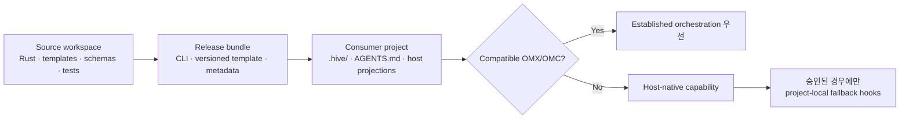

# Aigent Hive

[](rust-toolchain.toml)
[](Cargo.toml)
[](Cargo.toml)
[](.github/workflows/ci.yml)
[](copier.yml)
[](schemas/)
[](docs/plans/PLAN.md)
[](.github/workflows/ci.yml)
[](docs/plans/PLAN.md)
[](LICENSE)

> 🐝 **Aigent Hive**는 Codex, Claude Code, Gemini Antigravity 같은 구독형 agent host 위에서 일관된 setup, Skill routing, 역할·지식·run 상태, 안전한 update와 검증 계약을 제공하는 **provider-neutral 로컬 agent harness**다.

> 🚧 **현재 상태:** `0.1.0`은 source scaffold와 contract baseline이다. 설치 가능한 실제 consumer harness는 아직 구현 중이다.

Hive는 모델 API나 provider SDK를 사용하지 않으며 API key를 요청하거나 저장하지 않는다. Compatible OMX·OMC가 있으면 검증된 orchestration 기능을 우선 재사용하고, 없으면 host-native capability 범위에서 동작한다.

## 목차

- [지원 범위](#지원-범위)
- [핵심 원칙](#핵심-원칙)
- [아키텍처](#아키텍처)
- [기술 스택](#기술-스택)
- [의존성](#의존성)
- [저장소 구조](#저장소-구조)
- [개발과 검증](#개발과-검증)
- [Git workflow](#git-workflow)
- [현재 상태와 버전 정책](#현재-상태와-버전-정책)
- [라이선스](#라이선스)

## 지원 범위

| 구분 | 지원·동작 방식 | Hive의 필수 build dependency |
| --- | --- | --- |
| 🖥️ 운영체제 | macOS와 Windows CLI | 해당 없음 |
| 🤖 Agent host | Codex, Claude Code, Gemini Antigravity용 host adapter | 아니요 |
| 🧭 Orchestration | Compatible OMX·OMC가 감지되면 해당 기능을 우선 사용 | 아니요 |
| 🪶 Native fallback | OMX·OMC가 없으면 host-native capability 범위에서 동작 | 해당 없음 |
| 🔐 모델 접근 | 사용자의 정액제 host session만 사용 | API·provider SDK 없음 |
| 💾 데이터 | 우선 local-only; 정본은 Git 추적 가능한 text | cloud database 없음 |

OMX·OMC는 Hive와 함께 사용할 수 있는 우선 orchestration layer지만 필수 설치물은 아니다. Hive는 어느 host나 orchestration plugin에도 build 단계에서 결합되지 않는다.

## 핵심 원칙

- 🧩 **Provider-neutral:** 공통 contract를 먼저 정의하고 host별 파일은 projection으로 생성한다.
- ♻️ **재사용 우선:** OMX·OMC가 이미 잘 해결한 plan, team, persistent loop 기능을 다시 만들지 않는다.
- 📝 **Text가 정본:** Markdown·YAML·TOML을 Git으로 추적하며 SQLite는 언제든 재생성 가능한 검색 index로만 사용한다.
- 🛡️ **사용자 데이터 보호:** setup과 update는 ownership, staging, diff, backup, rollback 검증을 거친다.
- 🙋 **명시적 동의:** 외부 orchestration이 없을 때 제안되는 project-local fallback hook도 사용자가 내용을 확인하고 승인해야 설치한다.
- 📦 **Source와 출하물 분리:** 이 저장소의 개발 지침은 소비자 프로젝트에 그대로 복사하지 않는다.

## 아키텍처

Hive는 **source workspace**, **release bundle**, **installed harness**를 서로 다른 artifact로 관리한다.



| Artifact | 포함 내용 | 역할 |
| --- | --- | --- |
| Source workspace | Rust source, template, schema, test, 개발 지침 | Hive 자체를 개발하는 이 저장소 |
| Release bundle | CLI binary, versioned template·projection, 검증 metadata | 재현 가능한 GitHub Release 출하물 |
| Installed harness | `.hive/`, `AGENTS.md`, host projection | 독립된 소비자 프로젝트에서 실제로 동작하는 결과물 |

Copier는 template authoring과 CI parity 검증에만 사용한다. 배포된 Rust CLI와 consumer harness는 Python이나 Copier에 의존하지 않는다.

## 기술 스택

| 기술 | 사용 방식 |
| --- | --- |
| Rust stable, Edition 2021 | cross-platform CLI, setup/update 안전 경계와 결정적 projection |
| Cargo workspace | `hive-core`와 `hive-cli` 빌드·테스트·lint |
| Markdown | 계획, 지식, 지속형 역할, run 상태와 사람이 읽는 지침의 정본 |
| YAML·TOML | setup 답변, typed 설정, 승인 ledger와 ownership manifest |
| JSON Schema Draft 2020-12 | action, role, run, judge, capability 등 provider-neutral machine contract |
| Copier 9.17.0 + Jinja templates | authoring-time template와 Rust renderer parity fixture |
| Python 3.13 | CI의 Copier·schema conformance test 전용 |
| SQLite | 계획된 재생성 가능 로컬 FTS index; 정본이나 Git 추적 대상이 아님 |
| GitHub Actions | Linux·macOS·Windows Rust 검증과 Copier/schema conformance |
| GitHub Releases | 향후 signed CLI와 release bundle 배포 대상 |

## 의존성

현재 Rust runtime은 외부 crate를 사용하지 않는다. `hive-cli`는 workspace 내부의 `hive-core`에만 의존한다.

| 범위 | 고정 의존성 | 목적 |
| --- | --- | --- |
| Rust toolchain | `stable`, `rustfmt`, `clippy` | build, format, lint와 unit test |
| Template authoring·CI | `copier==9.17.0` | template render와 fixture parity |
| Schema test | `jsonschema[format]==4.25.1` | JSON Schema meta/instance 검증 |
| YAML test | `PyYAML==6.0.2` | setup·projection fixture 검증 |
| CI | `actions/checkout@v7.0.1` | repository checkout; commit SHA로 고정 |
| CI | `actions/setup-python@v7.0.0` | Python 3.13 환경; commit SHA로 고정 |
| CI | `dtolnay/rust-toolchain` | Rust stable 환경; commit SHA로 고정 |

정확한 CI pin은 [`.github/workflows/ci.yml`](.github/workflows/ci.yml), template pin은 [`copier.yml`](copier.yml), Rust 구성은 [`rust-toolchain.toml`](rust-toolchain.toml)에서 관리한다.

## 저장소 구조

```text
.
├── crates/
│   ├── hive-core/       # provider-neutral invariant와 target safety
│   └── hive-cli/        # `hive` CLI entry point
├── harness/             # 출하할 template, Skill, profile, projection source
├── schemas/             # provider-neutral JSON Schema contract
├── tests/               # Copier fixture와 conformance test
├── LICENSE              # GitHub가 감지하는 Apache-2.0 전문
├── LICENSES/            # REUSE용 Apache-2.0 canonical 전문
├── REUSE.toml           # file-scope license mapping
├── docs/
│   ├── architecture/    # 현재 설계
│   ├── decisions/       # ADR와 제품 결정
│   ├── plans/PLAN.md    # 유일한 active plan
│   └── state/CURRENT.md # evidence-backed 현재 handoff
├── .agents/             # Hive source 개발 전용 지침; 출하 대상 아님
└── .github/workflows/   # cross-platform CI
```

## 개발과 검증

🛠️ 기본 검증 명령:

```bash
cargo build --workspace
cargo fmt --all --check
cargo clippy --workspace --all-targets -- -D warnings
cargo test --workspace
cargo run -p hive-cli -- doctor
cargo run -p hive-cli -- check-target /path/to/consumer-project
```

CI는 Copier default·hostile fixture, schema instance, 지속형 role materialization과 optional Skill consent 변조도 함께 검증한다.

## Git workflow

| Branch | 용도 | 규칙 |
| --- | --- | --- |
| `main` | 보호된 안정·공개 배포 기준 | Pull Request와 필수 CI 필요; 삭제·force push 금지 |
| `develop` | 일반 개발과 통합 | 검증된 변경을 축적한 뒤 `main`으로 Pull Request |

장기 branch는 이 둘만 사용하며, 일반 변경은 `develop`에서 진행한 뒤 Pull Request로 `main`에 반영한다.

## 현재 상태와 버전 정책

| 항목 | 현재 값 |
| --- | --- |
| Product version | `0.1.0` |
| 완료 범위 | Phase 0 source scaffold와 contract baseline |
| 미구현 범위 | 설치 가능한 실제 consumer harness |
| 다음 구현 | Rust renderer, automatic OMX/OMC capability resolution, staging·ownership 검증, `hive setup`의 `--dry-run`, `--apply`, `--validate` 경로 |
| Active plan | [`docs/plans/PLAN.md`](docs/plans/PLAN.md) revision 1.5 |
| Handoff state | [`docs/state/CURRENT.md`](docs/state/CURRENT.md) |

Semantic version `X.Y.Z`는 다음 원칙으로 변경한다.

| 변경 종류 | 증가 항목 | 예시 |
| --- | --- | --- |
| Backward-compatible feature | Minor `Y` | `0.1.0` → `0.2.0` |
| 빠른 compatible bugfix | Patch `Z` | `0.2.0` → `0.2.1` |
| Breaking release | Major `X` | 사용자가 exact target을 명시적으로 지시한 경우에만 허용 |

## 라이선스

📄 Aigent Hive의 CLI, source, 출하 template과 생성된 Hive 소유 material은 모두 [`Apache-2.0`](LICENSE)으로 배포한다.

- 상용·비공개 제품에서 사용·수정·배포할 수 있다.
- 저작권·라이선스 고지와 변경 사항을 보존해야 한다.
- 명시적 특허 허여와 방어 조항이 적용된다.
- 소비자 프로젝트의 기존 source, 문서, 설정과 data는 Hive가 재라이선스하지 않는다.
- 생성된 harness에는 `.hive/LICENSE-AIGENT-HIVE.txt`가 포함된다.

자세한 적용 범위는 [`docs/licensing.md`](docs/licensing.md)와 [`REUSE.toml`](REUSE.toml)에 정의한다.
