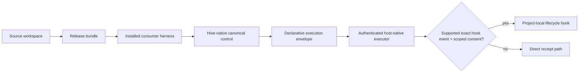

# 제품 개요

## 목적

Aigent Hive: subscription-authenticated Codex, Claude Code, Gemini Antigravity 위의
provider-neutral 로컬 agent harness.

제공 범위:

- 일관된 user·project setup
- Approved Skill routing과 host별 thin projection
- Canonical Markdown knowledge와 durable role·run state
- Subscription usage safeguard
- Verifier-only judge와 attested release·transactional update contract
- Ownership·backup·rollback 기반 안전한 mutation

비소유 범위:

- Model runtime·provider API client·model/subagent process launcher
- Provider credential·subscription session
- OMX·OMC runtime state와 foreign guidance
- 미승인 optional third-party Skill
- Package-manager-owned executable

## 지원 범위

| 구분 | 현재 범위 |
| --- | --- |
| Operating system | macOS arm64·Intel, Windows x86_64 candidate runtime 검증; Linux musl x86_64·arm64 qualification 진행 |
| Agent host | Codex·Claude Code·Gemini Antigravity adapter |
| Live evidence | Codex·Antigravity actual host; Claude subscription session 미검증 |
| Orchestration | Hive-native iterative·team·multi-goal control plane 계획 활성; host가 declarative envelope 실행, OMX·OMC 신규 dependency 없음 |
| Model access | 사용자의 subscription-authenticated host session |
| Data | Local-first tracked text, disposable SQLite |
| Consumer shell | Unix shell, Windows PowerShell 5.1, `cmd.exe`; PowerShell 7 불필요 |

정확한 current evidence: [CURRENT](../state/CURRENT.md).

## 핵심 원칙

- **Provider-neutral:** 공통 contract 우선, host별 파일은 projection
- **실행 경계:** Hive는 durable event·scheduler·lease·cancel·team·goal 판단 소유, host는 model·subagent 실행 소유
- **Text 정본:** Markdown·YAML·TOML canonical, SQLite 재생성 가능
- **사용자 data 보호:** ownership, staging, diff, backup, rollback, validation
- **명시적 동의:** Optional Skill·fallback hook·외부 설치의 preview와 approval
- **Artifact 분리:** Source workspace, release bundle, installed harness 분리
- **Credential boundary:** Provider API key 요청·저장·전달 없음
- **지식 보존:** 간소화 시 valid knowledge 이동, deprecated knowledge만 제거

## 주요 기능

| 기능 | 보장 | 상세 |
| --- | --- | --- |
| 결정적 setup | Typed answer·capability evidence 검증, manifest-owned path만 activation | [Source layout](../architecture/source-layout.md) |
| User onboarding | Language-first setup, selected host·Skill projection, user-root preference | [ADR-0012](../decisions/ADR-0012-global-onboarding-shared-index.md) |
| Project onboarding | Global preference 상속, unresolved essential question만 확인 | [ADR-0009](../decisions/ADR-0009-user-plugin-project-knowledge-boundary.md) |
| Skill routing | Bounded knowledge retrieval 뒤 simple-question isolation과 최소 approved Skill 선택 | [Skill consent](../architecture/skill-consent.md) |
| Prompt refinement | Explicit prompt intent의 `refine-only`, ordinary prompt hidden rewrite 금지 | [Product decisions](../decisions/product-release-decisions.md) |
| Knowledge | Canonical Markdown, shared disposable SQLite FTS5 RAG, cross-project provenance와 portable bundle | [ADR-0016](../decisions/ADR-0016-global-knowledge-rag.md) |
| Persistent role·run | Role identity·handoff·criterion·owner pin과 fresh-session recovery | [Role](../architecture/role-lifecycle.md) · [Run](../architecture/run-lifecycle.md) |
| 반복 실행 | Default-off Hive-native scheduler·receipt·cancel·team·multi-goal 계획 | [ADR-0019](../decisions/ADR-0019-hive-native-iterative-execution.md) |
| Usage guard | Native-first sensor, configured Hive target only, automatic dispatch fail-closed | [Source integration](../guides/source-usage-guard.md) |
| Judge quorum | Clean-context package와 detached Ed25519 verification | [Judge boundary](../architecture/judge-trust-boundary.md) |
| Release·update | Attestation·local integrity, version gate, backup·journal·recovery | [Release boundary](../architecture/release-update-trust-boundary.md) |
| Direct install | npm과 digest-pinned curl·PowerShell·CMD channel | [`0.9.2` release](../releases/0.9.2.md) |

## Artifact 흐름

## Version·release 상태

- Current source version: `0.9.2` 완료 기능 안정판
- Latest published version: `0.9.0`
- `0.9.0`: npm `latest=0.9.0`, normal GitHub Release, annotated Git tag 게시 완료
- `0.9.1`: 미등록 project Wiki lint의 user-root 폴백과 전체 `v0.9` 수용 재검증 뒤 게시
- `0.9.2`: 설치 product usage guard 단일 정본 전환과 공개 문서·package metadata 동기화
- Major: exact 사용자 지시 전 자동 준비·추론 금지

관련 문서:

- [Version lifecycle](../decisions/ADR-0006-version-lifecycle.md)
- [`0.8.0` release scope](../decisions/ADR-0013-0.8-release-scope.md)
- [License](../licensing.md)
