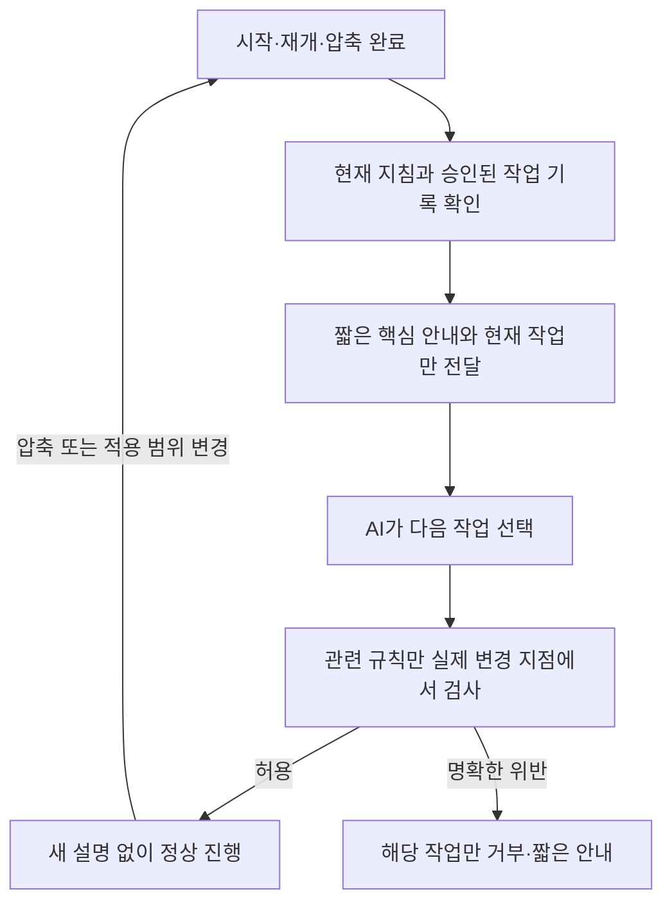

# 반복 압축 뒤 지침 복구 구현안

> 기준일: 2026-09-25
> 대상: 현재 제품 목표 0.11.0
> 상태: 조사·계획 완료, 제품 구현 전 제안
> 근거: [공식 자료·저장소 조사](../research/directive-context-hooks-2026-09-25.md)

## 목표와 범위

- 여러 차례 압축 뒤에도 필요한 지침을 복원하고, 명확한 금지 사항은 실제 작업 지점에서 검사
- 정상 작업에 불필요한 지침 반복·추가 모델 호출·거부 후 재시도 최소화
- 이번 요청은 조사와 구현 계획. 아래 단계는 아직 구현·실제 호스트 시험을 마치지 않은 상태
- 기존 48개 완료 기준과 별도인 후속 제안. 실행 승인 시 아래 작업을 활성 제품 체크리스트에 등록, 해당 수용 완료 전 안정판 완료 주장 제외
- Codex 우선, Antigravity는 압축 인식·문맥 수명 검증 뒤 확대. 기존 Claude 실제 수용 제외와 다른 조사 도구의 미지원 범위 유지

## 권고 흐름

- 정본: 기존 AGENTS.md·지침·PLAN·STATUS·승인 기록. 매번 새 모델로 요약하거나 이전 요약을 다시 요약하는 방식 제외
- 안내 목록: 규칙 ID, 원문 위치·내용 지문, 짧은 검토된 설명, 적용 작업·경로, 검사 위치, 우선순위
- 자연어 전체를 실행 규칙으로 자동 변환하지 않고 기존 정책 ID·검사기를 먼저 연결
- 새 핵심 안내는 사용자 목표·금지 사항·허용 범위·현재 단계·다음 확인 자료로 구성. 민감 정보와 대화 원문 제외

## 호출과 비용 제어

| 시점 | 처리 | 모델에 추가할 내용 |
| --- | --- | --- |
| 새 세션·재개·압축 완료 | 원문·현재 작업 재확인, 이전 전달 상태 무효화 | 핵심 안내와 현재 단계 |
| 같은 문맥·같은 작업 범위 | 필요한 코드 검사만 실행 | 정상일 때 0개 |
| 다른 작업·경로·정책 변경 | 관련 자료 다시 확인 | 변경된 관련 절만 |
| 중요한 변경 직전 | 소유권·권한·현재 상태 검사 | 위반 이유와 수정 경로만 |
| 작업 마무리 | 해당 작업의 완료·형식 검사 | 필요한 결과만, 자동 수정은 최대 1회로 제한하는 안 |

파일 지문이 같아도 압축이 새로 발생하면 핵심 안내를 다시 전달하는 기준. 파일 캐시는 계산 재사용용이며 모델 기억·실행 권한의 증거는 아님.
중복 억제는 신뢰할 수 있는 동일 이벤트 ID가 있을 때만 적용. 같은 세션·턴 ID나 시간 간격만으로 두 번째 압축을 생략하는 방식 금지.
하위 에이전트는 별도 문맥으로 취급. 부모 세션 ID를 공유한다는 이유로 전달 완료 상태 공유 금지.

초기 예산안: 핵심 안내 300~600토큰, 관련 단계 포함 1회 1,000토큰 이하 목표와 UTF-8 4,096바이트 상한.
정확한 토크나이저가 없으면 바이트만 확정 측정하고 토큰은 추정으로 표시. 필수 조건을 자르지 말고 등록 단계에서 분할·표현 재검토.
호스트 출력 잘림을 정상 복원으로 인정하지 않는 기준. 수치는 외부 권장 상수가 아닌 초기 시험 목표.

## 구현 순서와 확인 기준

1. **기준선과 지침 목록 확정**
   - 코드 강제·구조 검사·의미 판단·작업 상태로 분류. 중복·충돌과 실제 읽기 경로 확인
   - 각 규칙에 적용 작업·최종 검사 위치·복원 문구 지정. 기존 지침 전체 삭제나 무조건 축약 제외
   - 확인: 모든 대상 규칙에 담당 경로와 검증 방법, 비용 측정 범위 존재

2. **지침 선택·출력 모듈 구성**
   - 제안 위치: crates/hive-core의 기존 policy 판정 재사용, crates/hive-cli/src/policy/directive_context.rs의 제한된 파일 읽기·출력
   - 관련 절 선택은 등록된 작업·경로 조건 사용. 매 호출의 의미 분류용 모델 추가 제외
   - 승인된 정본만 읽고 경로·크기·내용 지문 검사. 비밀 값·외부 임의 문서를 높은 우선순위 지침으로 승격하는 동작 제외
   - 확인: 동일 입력의 동일 출력, 예산·경로 이탈·오래된 내용 거부, 데이터 쓰기 권한 자동 부여 없음

3. **Codex의 압축 후 복구 연결**
   - 수정 위치: policy/native.rs의 고정 CONTEXT와 policy/configure.rs의 시작 이벤트 등록
   - SessionStart의 startup·resume·compact를 분리. compact 때 다음 모델 요청 전 핵심 안내 전달
   - PostCompact는 상태 관측용으로만 시작. 원문 출력이 문맥에 들어간다고 가정하지 않는 기준
   - 실제 수동·자동·턴 중간 압축과 같은 턴의 연속 압축으로 복원 확인. 문구 출력·전달·준수의 증거 분리

4. **중요 작업의 코드 검사와 상세 안내 연결**
   - 기존 Hive 파일 보호·유효 승인·사용량·Git·출시 검사를 실제 변경 위치에서 재사용
   - 정상 허용은 짧은 구조화 결과, 거부는 작업 범위 안의 이유만 제공. 읽기·조회·취소·복구 접근 유지
   - 의미 판단만으로 일반 작업 차단 금지. 셸 문자열 분석만으로 모든 우회 방지를 주장하는 방식 제외
   - 확인: 보호 위반 0건, 정상 요청의 잘못된 차단 0건. 훅 우회 경로는 별도 검사 또는 명시적 미지원

5. **호스트 차이와 설정 흐름 연결**
   - Codex는 압축 이벤트 기반 복구 우선. Claude의 자동 복원과 중복 여부는 향후 해당 호스트 수용 때 확인
   - Antigravity는 PreInvocation과 문맥 내 안내의 유지 여부부터 검증. 압축 횟수 추정이나 원문 대화 분석으로 복원 성공 판정 금지
   - 압축 식별이 없으면 호출마다 매우 짧은 안내를 주는 선택안의 실제 토큰 비용 비교, 확인 전 반복 압축 보장 제외
   - project-setup·user-setup 및 설치 갱신 흐름에 미리보기·선택·등록·작동 확인·철회 연결. 설치 파일 존재만으로 활성 판정 금지
   - 과거 사용자·다른 도구의 설정 보존, 소비자·소스·사용자 루트 분리. 소스에 소비자 .hive 생성 금지

6. **반복 압축과 비용 비교**
   - 비교군: 기존 동작, 전체 지침 반복, 제안한 선택 전달. 같은 작업·모델·자료로 비교
   - 압축 0·1·3·5회 기본, 10회 연속 압축을 출시 전 강화 시험으로 추가. 수동·자동·같은 턴·재개·하위 작업 포함
   - 같은 지문 뒤 재압축, 작업 범위 변경, 사용자 승인 변경, 지침 변경, 누락 이벤트·미로드·시간 초과·잘린 출력 검사
   - 실제 파일 효과·승인 준수·현재 언어·필수 완료 항목으로 판정. 지침 암송만으로 성공 판정 금지
   - 최소 표본으로 시작해 취약 조건을 3회 반복, 결과가 흔들리면 해당 조건만 확대. 단계별 사용량 예산과 중단 기준을 먼저 확정

7. **출시와 점진 적용**
   - 기준을 통과한 Codex 경로부터 선택 적용, 지원 이벤트·운영체제별 결과 명시
   - 기존 설정 복원과 즉시 철회 검증. 기능이 확인되지 않은 호스트의 보장 표시 금지
   - 제품 변경이 생긴 구현 단계에서 현재 0.11.0의 다음 번호 시험판과 공개 파일 검사. 이번 계획 작성으로 새 시험판 발행 없음

## 수용 기준

- 코드로 정의한 중요한 위반의 성공 0건, 정상 작업의 불필요 차단 0건
- 각 확인된 압축 사건 뒤 핵심 안내 누락 0건. 적용 가능한 상세 지침만 새로 전달
- 의미 지침은 고정 평가 묶음에서 준수율·분모·변동을 보고하고 전체 문구 전달 비교군보다 악화 시 보완. 보편적인 100% 보장 제외
- 제안 방식의 새 지침 토큰을 전체 반복 비교군보다 50% 이상 줄이는 초기 목표. 실제 전체 입력·출력·캐시 사용량도 별도 측정
- 불필요 모델 호출 0회, 원문 대화·숨은 추론·기밀 자료의 수집 0건
- 현재 훅 지연과 신규 처리 시간을 분리, 동일 호스트의 정상 편집 지연 증가 10% 이내 초기 목표
- 부족한 호스트 자료·측정 불가 토큰은 미검증 표시. 목표 미달을 상한 확대나 검사 생략으로 통과시키는 방식 제외

## 권한과 기록

모든 안내의 전달 여부는 준수·실행 허가와 별개. 모델이 따르겠다고 말한 결과는 승인이나 검사 영수증의 대체물에서 제외.
문맥 상태는 기존 실행 기록·영수증과 결합한 최소 메타데이터로 유지. 원문은 기존 Markdown에 두고 두 번째 지식 DB 생성 제외.
지침 선택 캐시만 재사용하며 실제 쓰기 권한은 매 변경 직전 확인. 설치·활성화의 기존 사용자 승인 경계 유지.

연결: [활성 계획](PLAN.md), [정책 검사 목록](../architecture/policy-rule-inventory.md), [이전 문구 작업](../research/patch-note-audience.md).
