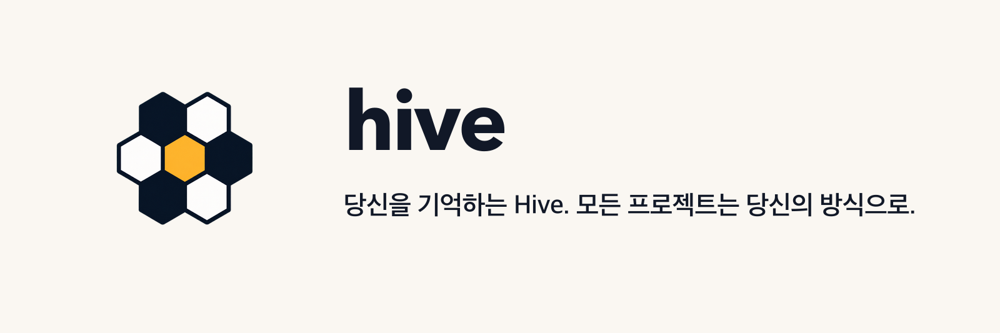

# Aigent Hive

<p align="center">
  
</p>

> Codex, Claude Code, Gemini Antigravity를 위한 provider-neutral 로컬 harness.

[](../../Cargo.toml)
[](../../rust-toolchain.toml)
[](../../LICENSE)

[English](../../README.md) · [한국어](./README.ko.md)

Hive: subscription 인증 agent host에 일관된 setup, Skill routing, project knowledge,
지속 가능한 role/run 상태, usage safeguard와 안전한 update 계약 제공.
Model-provider API key 요청·provider API 호출·host model runtime 대체 없음.

현재 stable `0.9.2`: npm `latest`, normal GitHub Release, annotated Git tag 배포.

## 현재 stable 설치

npm `0.9.2|latest`, GitHub normal Release, annotated Git tag 배포.

기본 설치:

```console
npm install -g aigent-hive
```

또는 exact version 고정:

```console
npm install -g aigent-hive@0.9.2
```

npm 설치 dependency: Node.js·npm. 설치된 `hive` runtime: native Rust binary,
Node.js dependency 없음.

예상 stable version label:

```text
AIgent Hive v0.9.2 (released 2026-08-12)
```

### macOS·Linux curl

```sh
curl --proto '=https' --tlsv1.2 -LsSf \
  https://unpkg.com/aigent-hive@0.9.2/install.sh | sh
```

### Windows PowerShell 5.1+

```powershell
irm https://unpkg.com/aigent-hive@0.9.2/install.ps1 | iex
```

### Windows 명령 프롬프트

```bat
curl.exe -fLo install-aigent-hive.cmd https://unpkg.com/aigent-hive@0.9.2/install.cmd && install-aigent-hive.cmd
```

직접 installer: npm의 동일 native package bytes 수신, embedded exact-version
SHA-256 검증, direct-install ownership receipt 기록. npm·Node.js·PowerShell 7
dependency 없음.

## 선택형 one-prompt 설정

Codex, Claude Code 또는 Gemini Antigravity에게 user-level 설치 전체 진행을 맡기려면 아래
prompt 사용. 선택 사항이며, 아래 4단계 설정은 예측 가능한 수동 경로로 유지.

```text
I want the optional one-prompt Aigent Hive setup. Work only at user scope; do not inspect,
initialize, or change any project, repository, folder, or current working directory.

Install the current stable release 0.9.2. The stable install guidance is
https://github.com/gvm1229/aigent-hive#install-the-current-stable-release.
Detect my operating system and active host (Codex, Claude Code, or Gemini Antigravity), asking
me if either is unclear. Check whether Node.js and npm are available. If they are missing,
give me the official OS-specific Node.js installation command and request any approval the host
requires before installing it. Then install the exact Hive release I selected using the official
method in the linked guidance, verify `hive --version`, and activate only my host with
`hive install --scope user --host <detected-host> --apply --output json`.

Then begin interactive global setup in this conversation. For a first setup, ask only whether I
want English or Korean first; continue one question at a time. For existing settings, first ask
whether I want to change one setting or review everything. Do not start project setup afterward:
offer the separate project-setup prompt instead. Never ask for provider API credentials or install
an optional third-party Skill.
```

이 선택지는 현재 stable release만 설치.

프로젝트 유지보수자용 [출시 검증 안내](../guides/release-verification-builds.md).

## 지원 target

| Platform | Native target | 0.9.2 gate |
| --- | --- | --- |
| macOS Apple Silicon | `aarch64-apple-darwin` | Candidate runtime 검증 |
| macOS Intel | `x86_64-apple-darwin` | Candidate runtime 검증 |
| Linux x86_64 | `x86_64-unknown-linux-musl` | Release qualification 진행 중 |
| Linux arm64 | `aarch64-unknown-linux-musl` | Release qualification 진행 중 |
| Windows x86_64 | `x86_64-pc-windows-msvc` | Candidate runtime 검증 |

Codex·Antigravity는 실제 host 증거가 있음. Claude Code package·projection은 fixture로
검증했지만 실제 subscription-backed session은 미검증. Stable `0.9.2`: macOS ad-hoc signing,
SignPath Foundation 무료 승인 전 Windows unsigned 공개. 정확한 경계는
[code signing policy](../guides/code-signing-policy.md) 참고.

## 첫 설정

아래 4단계 순서. Host마다 2단계, project마다 4단계 반복. Global preference 변경 시 3단계 재실행.

### 1. Hive CLI 설치

위 [현재 stable 설치](#현재-stable-설치) 중 한 가지 명령 사용. npm 설치 범위: `hive` command 제공;
host 내부 Hive 활성화 전 단계.

### 2. 이 host에 Hive 연결

Terminal에서 host projection 활성화:

```console
hive install --scope user --host codex --apply --output json
```

필요 시 `codex`를 `claude` 또는 `antigravity`로 변경. 이 작업은 authenticated known prior user
installation을 현재 projection으로 갱신하기 전에 복구. Unknown 또는 modified ownership manifest는
계속 거부.

### 3. Global preference 설정

Codex, Claude Code 또는 Gemini Antigravity에서 아래 공통 prompt 입력:

```text
Configure or reconfigure my global Aigent Hive preferences for this host. Do not inspect or configure a project, repository, folder, or current working directory. Start the interactive user-scope setup.
```

최초 설정·기본값 변경용 prompt. User-scope language·Wiki·persona·Skill·update preference만
설정; 현재 folder inspection·project harness 생성 없음.

모든 built-in Skill: 기본 활성화. 더 작은 구성이 필요하면 setup 중 Skill을 하나씩 선택. `user-setup`은
항상 활성 상태 유지. Profile·persona·selected host는 활성 Skill set 변경 없음. Earlier recommended
suite 설정: 새 preview 검토·승인 전 기존 Skill set 유지.

### 4. Project 한 개 설정

Host에서 정확한 project를 열고 아래 별도 prompt 입력:

```text
Configure the local Aigent Hive harness for this project. Use my existing global Hive preferences, inspect only this project, show the exact write preview, and ask me only about choices that require my approval.
```

Project마다 한 번씩 사용. Global preference 상속, exact write preview 후 해당 project만 변경.
Host에서 project open 불가 시 absolute path 명시:

```text
Configure the local Aigent Hive harness for the project at /absolute/path/to/project. Use my existing global Hive preferences, inspect only that project, show the exact write preview, and ask me only about choices that require my approval.
```

Home directory에서 path 없는 project prompt 사용 금지. 두 scope 동시 요청: global setup 완료 후
project inspection·change 전 별도 확인.

두 prompt 모두 update, optional third-party Skill, provider credential 접근 권한 포함 없음.

## 업데이트

```console
hive update
```

즉시 version 확인. 새 version이 있으면 exact update 내용을 설명하고 authenticated
install owner를 실행하기 전에 질문. 거절·stdin 종료·noninteractive 실행에서는 설치
mutation 0건.
기존 `0.9.0-test.N` 또는 `0.9.0` 설치의 소유권 증거 유지. 같은 확인 절차로 exact stable
`0.9.2` 갱신 가능.

Daily check: 마지막 성공 확인부터 24시간 throttle. Offline·failed check는 성공
기록 제외; 다음 Codex·Claude Code·Antigravity session에서 재시도.

Silent update: 금지.

## Automatic dispatch safeguard

Enabled 상태에서는 새 automatic dispatch 직전에 subscription usage 확인:

```console
hive usage enforce --target <project> --session-id <id> --process-id <pid> --output json
hive run resume --dispatch-intent automatic --target <project> --run <run-id> --capabilities <json> --output json
```

첫 command: preflight only, dispatch 단독 승인 authority 없음. External runtime의
cancellation 결과는 보조 evidence이며 durable goal/task 상태 대체 불가. 일반 응답과
manual 작업: automatic-dispatch gate 적용 제외.

## Hive 소유 범위

- Hive marker block과 manifest에 기록된 파일
- Provider-neutral Skill과 얇은 host projection
- Canonical Markdown·YAML·TOML state
- Canonical text에서 재생성하는 disposable SQLite index
- 검증된 direct-install receipt

Provider credential, model session, foreign guidance, OMX·OMC state, Homebrew·WinGet
installation과 미승인 optional third-party Skill은 Hive 소유가 아님.

## Architecture·maintainer 문서

- [문서 홈](../00-home.md)
- [전체 문서 색인](../01-index.md)
- [제품 개요](../overview/product.md)
- [개발·검증](../guides/development.md)
- [Active plan](../plans/PLAN.md)
- [현재 project 상태](../state/CURRENT.md)
- [Source layout](../architecture/source-layout.md)
- [Release·update trust boundary](../architecture/release-update-trust-boundary.md)
- [Code signing policy](../guides/code-signing-policy.md)
- [제품 결정](../decisions/product-release-decisions.md)

개발 dependency: Rust stable, conformance test용 Python 3.13, Windows 개발·release
workflow용 PowerShell 7. Consumer install dependency: Python·PowerShell 7 없음.

```console
python scripts/dev-check.py pre-push
```

## QA 기여자

| 이름 | GitHub | 검증 환경·영역 |
| --- | --- | --- |
| 안희준 | [No-Jyun](https://github.com/No-Jyun) | Windows x64 설치·설정 검증 |

## 라이선스

Apache-2.0. [LICENSE](../../LICENSE) 참고.
